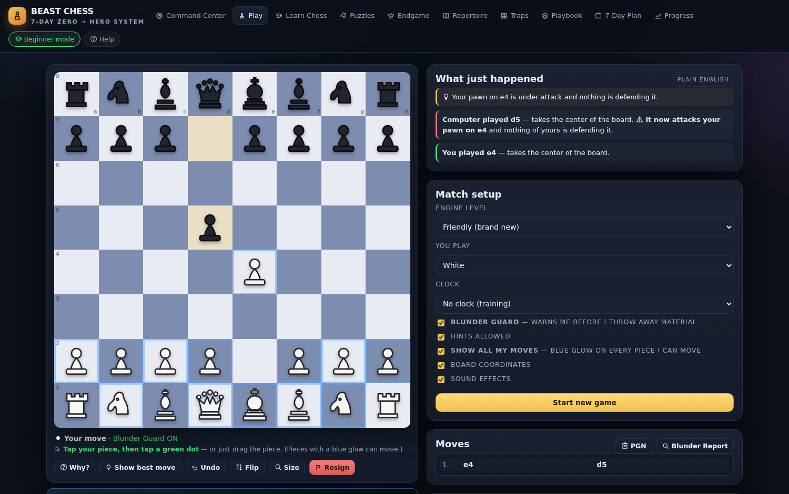

# ♟ Beast Chess — 7-Day Zero → Hero

**Live site: https://codedbytahir.github.io/beast-chess/** &nbsp;·&nbsp; **Play now: https://codedbytahir.github.io/beast-chess/play.html**

A complete chess training system for people who have never played — and a hard 7-day crash course for people who want to win a district-level match next week.




Everything runs in **one self-contained HTML file**. No signup, no server, no CDN, no analytics. Download it, open it, and it works offline (including saving your progress, XP and 7-day plan in your own browser).

---

## What's inside

| | |
|---|---|
| 🎓 **Learn Chess (11 lessons)** | Total-beginner on-ramp: board, pawn, knight, bishop, rook, queen, king, check & checkmate, back-rank mate, castling, stalemate. Every lesson is an interactive sandbox — click or drag pieces and the app replies in plain English. |
| 🎮 **Guided first game** | The coach tells you exactly what to play (e4, Nf3, Bc4, O-O) and narrates what the computer is threatening, in words a non-player understands. |
| ♟ **Play vs AI** | 6 levels, **Friendly (brand new, ~800)** → **Nightmare (~1900)**. Blunder Guard, hints, "🤔 Why?" (best move *plus the reason*), unlimited undo, flip, board-size control, PGN export. |
| 🧩 **343 puzzles** | Mate-in-1, mate-in-2, find-the-tactic, only-move defence — sorted easiest-first in beginner mode. |
| 👑 **Endgame Lab** | 7 engine-verified drills: K+Q, K+R, two rooks, K+P, Q vs pawn, R+P, and the K+P drawing technique. |
| 📖 **Repertoire** | A complete opening plan for White and Black with the ideas and the plans, plus a book-move quiz. |
| 🪤 **Traps** | 10 classic traps (Scholar's, Fool's, Legal's, Stafford, Englund…) with the antidote for each. |
| ⚔ **Playbook** | The strategy codex: 6-question blunder firewall, pawn structures, king safety, converting wins. |
| 🗓 **7-Day Plan** | Day-by-day syllabus with sessions, KPIs and homework. |
| ⚑ **Result signs** | Every finished game is stamped across the board: **CHECKMATE** (gold, with the mated king glowing red), **CHECK!** when a king is attacked, **DRAW** for stalemate/repetition, **DRILL COMPLETE** in the Endgame Lab. A king is never captured — chess ends by checkmate, and the app now teaches and enforces exactly that. |
| 📈 **Progress** | XP, ranks, streaks, lesson completion, and a post-game blunder report. A lesson only counts as read (and only pays XP) once you actually engage with it — move a piece in the sandbox or press "I have read this" — so the checkmarks and the "resume where I left off" pointer stay honest. |

## Start here
1. Open the live site and press **Start training**.
2. Answer **"I have never played chess"** → Beginner Mode turns on and Lesson 1 opens.
3. Do lessons 1–11, play the **guided first game**, then switch the top-bar pill to **🏆 Training mode** and begin Day 1 of the plan.

---

## Project layout

```
beast-chess.html      ← THE DELIVERABLE: the whole dashboard, one file (~390 KB)
BEAST-CHESS-MANUAL.md ← the written 7-day course (syllabus, tactics, traps, endgames, match day)
src/
  engine.js           ← zero-dependency chess engine (legal moves, search, eval, mate solver)
  board.js            ← pointer/touch board with drag & drop, arrows, promotion
  app.js              ← 10 views, lessons, coach, guided game, routing, XP
  index.html          ← shell + full design system (CSS)
  content-*.js        ← syllabus, tactics, traps, openings, codex data
data/                 ← generated puzzle + content JSON
tools/
  build.js            ← bundles src/ → beast-chess.html
  site.js             ← generates index.html (landing) + play.html for GitHub Pages
  gen-puzzles.js      ← puzzle generator/verifier
  gen-content.js      ← content verifier (must report 0 problems)
tests/perft.js        ← move-generation correctness (perft) suite
index.html, play.html ← generated: the published GitHub Pages site
```

## Rebuilding

```bash
npm test            # engine perft suite + content validation
npm run test:e2e    # 26-check browser regression suite (needs: npm i puppeteer)
npm run deploy      # rebuild beast-chess.html + regenerate the published pages
npm start           # serve the site locally on :8080
```

## How it was verified

The app ships with a regression suite that drives a real browser with real mouse, touch and pointer events:

- **`npm test`** — perft move-generation tests all pass (start position, Kiwipete, position 3, 4); content validation reports 0 problems
- **`npm run test:e2e`** — 40 checks in a real browser: onboarding wizard, lesson sandboxes, the icon system (every icon painted by an SVG mask), playing a legal move with real pointer events, engine reply, coach log, board squareness, guided-game step advance, all 10 views, easiest-first puzzle ordering, XP persistence across reload, deep links, touch play on a phone, the mate sign + win popup (by move order number, not by square index), the losing-mate path, the CHECK sign, and a king-capture ban verified by scanning every legal move in a mate-in-progress position — **0 failures, 0 page errors**
- **Content**: 0 problems across all lessons, traps, openings and drills
- **Board geometry**: pixel-perfect square board + 64 square cells at 8 viewports (320×560 → 1920×1080), zero page overflow
- **Flows**: beginner wizard → lessons → guided game → play → all 4 puzzle modes → endgame drills → traps → opening quiz → plan/XP persistence → PGN export — with 0 page errors
- **Input**: real mouse clicks, real drag-and-drop (with ghost preview), emulated finger taps and drags on mobile
- **Sandbox**: verified inside a `sandbox="allow-scripts"` iframe (no storage, no URL access) — the app degrades gracefully and stays fully playable

## Notes
- **Icons are inline SVG** (46 of them, masked data-URIs) — no emoji fonts and no icon CDN, so nothing breaks on Linux/Android/old browsers.
- **The board is sized in JavaScript**, pixel-exact, and re-fits on resize/rotation; a pure-CSS `aspect-ratio` board collapses in short windows and embedded iframes.
- **Progress saving needs a real browser tab.** In a sandboxed preview iframe, `localStorage` is blocked, so the app runs fine but forgets your XP — that's the preview's limitation, not the app's. The GitHub Pages version saves normally.

MIT licensed — use it, share it, teach with it.
